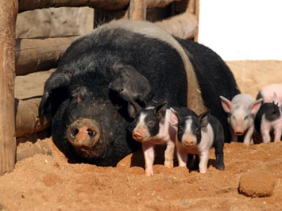

  
# A brief description of the data



We have piglet weights for 8 different pigs (in kg):

```{r}
dat <- read.csv("../Code/Datasets/poland.dat", sep = "\t", h = F)
dat
```
?

# Estimate a pig's piglet weight

```{r}
y <- dat[,1]
y
```

# Compare two or more pigs' piglet weights